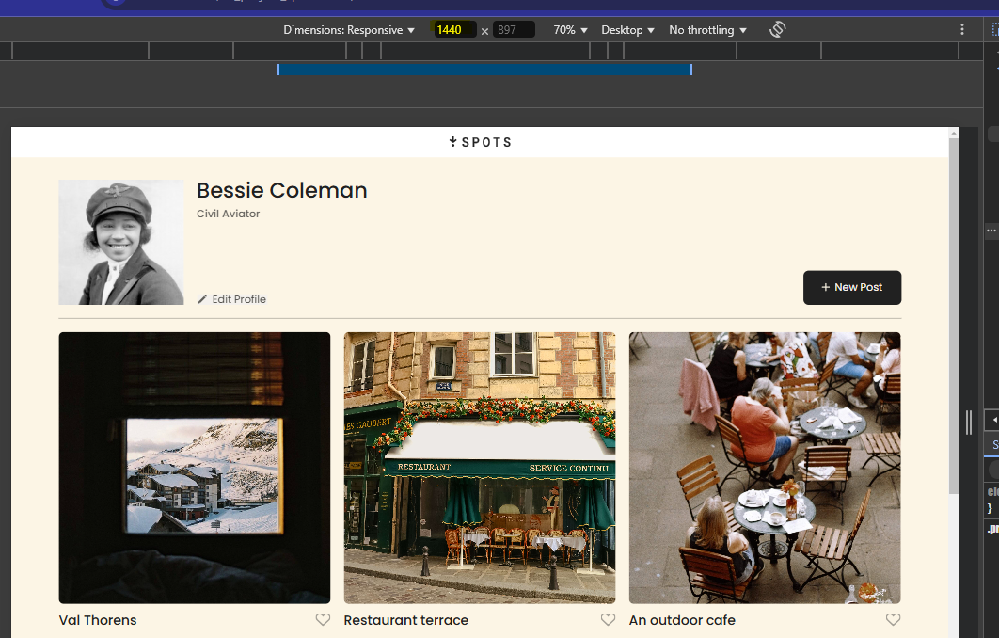
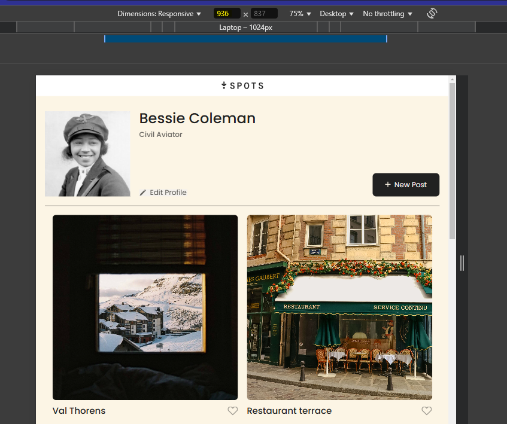
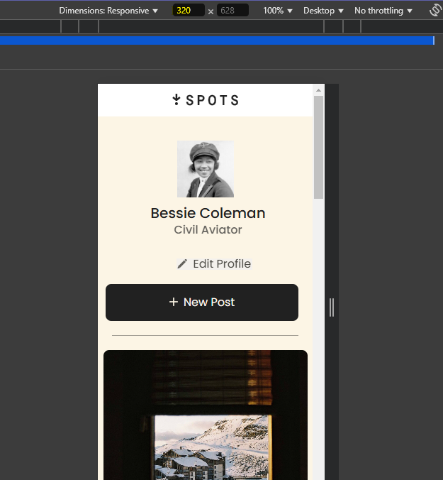

# Project 3: All about the Spots!

### Overview

- Intro
- Technologies and Techniques
- Some Features
- GitHub Link

**Intro**

This project is about
detailing a profile that is similar to Instagram's layout, being viewed on different screen sizes. The layout will auto-respond to the device it's being viewed on.

**Technologies and Techniques**

Below is a list of what is used in this project:

- Flex box.
- Grid box.
- Button features.
- Hover effects.
- @media inquiries.
- JavaScript:
  - Open/close modal of _edit profile_ and _new post_ buttons.
  - Edit of name and description.
  - Adding/deleting a new post.
  - Liking/unliking a post.
  - Preview modal of posts when clicked on.
  - Exiting out of any modal by clicking anywhere outside of the modal or pressing the "esc" key.
  - The _New Post_ modal will reset only after hitting the _save_ button... not if you accidentally exit out, click out of the modal, or press the "esc" key.
  - Form validation:
    - Error messages.
    - Error indications.
    - The _Submit_ button will be disabled until the "form" is filled out correctly.

**Some Features**

- The above image shows the device at `1440px` screen size.

- The above image shows the device at `936` screen size.

- The above image shows the device at `320` screen size.

**GitHub Link**

https://tamianna.github.io/se_project_spots/

**Google Drive Video link**

- Below is my first video exemplifying what my webpage does after the first stage of the project:
  https://drive.google.com/file/d/1k40RzKTjKMPSrNxRCRpIEIq7u-I7HsCU/view?usp=sharing

- Below is an updated video showing the features from JavaScript:
  https://drive.google.com/file/d/14cVXqSwFhY5jK1GUxAQmtBjCvu5bSG76/view?usp=sharing
